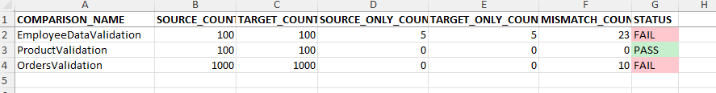

# ETL File Comparison Framework

## Overview

This project is a configuration-driven ETL File Comparison Framework developed using Python.

The framework compares source and target files based on a configuration file, identifies missing records and data mismatches, and generates a detailed Excel report.

The primary goal of this project was to build a reusable utility that can be extended for different ETL validation scenarios instead of writing comparison scripts for every new requirement.

---

## Features

- Compare multiple file pairs in a single execution
- Configuration-driven execution using Excel
- Supports single and composite business keys
- Compare all columns or selected columns
- Identifies records missing in Source
- Identifies records missing in Target
- Identifies column-level data mismatches
- Generates formatted Excel reports
- PASS / FAIL status for each comparison
- Application logging
- Modular and reusable design

---

## Project Structure

```
ETL_File_Comparison_Framework
│
├── input
│   ├── comparison_config.xlsx
│   ├── source_files
│   └── target_files
│
├── output
│
├── logs
│
├── config.py
├── logger.py
├── file_reader.py
├── comparator.py
├── report_generator.py
├── main.py
│
├── requirements.txt
└── README.md
```

---

## Configuration File

The framework is completely configuration driven.

Each row in the configuration file represents one comparison.

| Column | Description |
|---------|-------------|
| COMPARISON_NAME | Name of the comparison |
| RUN_FLAG | Y = Execute, N = Skip |
| SOURCE_FILE | Source file name |
| TARGET_FILE | Target file name |
| FILE_DELIMITER | Delimiter used in the file |
| KEY_COLUMNS | Business key columns |
| COMPARE_COLUMNS | ALL or comma-separated column names |

Example:

| COMPARISON_NAME | RUN_FLAG | KEY_COLUMNS | COMPARE_COLUMNS |
|-----------------|----------|-------------|-----------------|
| EmployeeValidation | Y | EMP_ID | ALL |
| ProductValidation | Y | PRODUCT_ID, STORE_ID | PRICE, STOCK |

---

## Generated Report

The framework generates an Excel report containing the following sheets:

### Summary

Provides an overview of every comparison including:

- Source Record Count
- Target Record Count
- Missing Records
- Mismatch Count
- PASS / FAIL Status



### Missing in Source

Records available only in the Target file.

### Missing in Target

Records available only in the Source file.

### Data Mismatches

Displays column-level mismatches with:

- Comparison Name
- Business Key
- Column Name
- Source Value
- Target Value

---

## Technologies Used

- Python
- Pandas
- OpenPyXL
- Logging Module

---

## How to Run

Clone the repository.

Install the required packages.

```bash
pip install -r requirements.txt
```

Place the input files inside the input folders.

Run the application.

```bash
python main.py
```

The generated report will be available in the **output** folder.

Application logs will be available in the **logs** folder.

---

## Why I Built This

In ETL projects, comparing large datasets between source and target systems is a common activity during migration and data validation.

Instead of writing comparison scripts for every project, I wanted to build a reusable framework that can be configured through an Excel file and easily extended for future requirements.

The framework was intentionally designed with separate modules for reading data, comparison logic, report generation, and logging to keep the code easy to understand and maintain.

---

## Future Enhancements

Some improvements planned for future versions include:

- Database to Database comparison
- Ignore Case comparison
- Ignore Spaces comparison
- Ignore Date Format
- Ignore Decimal Precision
- Support for Excel, JSON and Parquet files
- HTML report generation
- Rule-based comparison engine

---

## Author

Lokesh Cheekati
